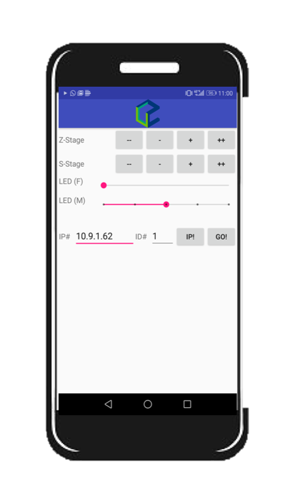
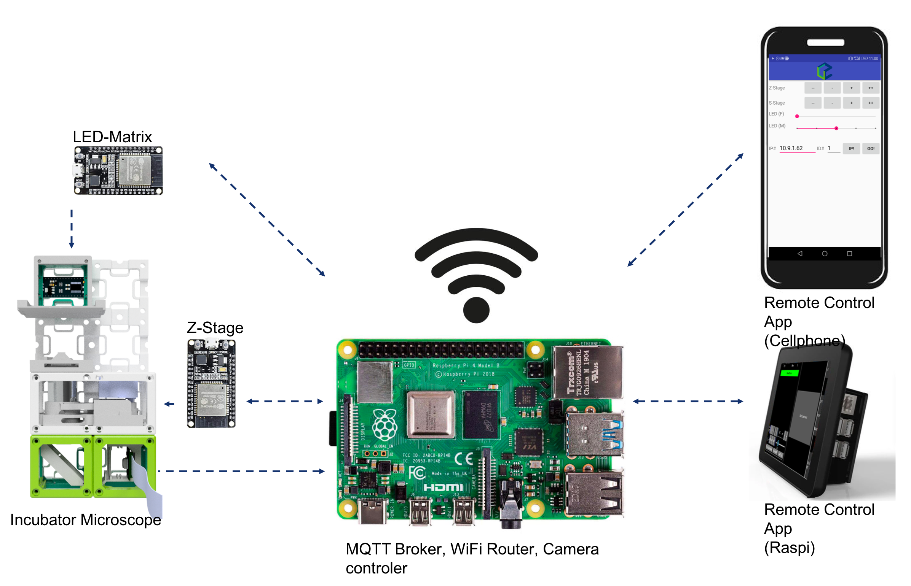

# UC2 remote controller via the MQTT-protocol

This is the Android Remote Control for ***TheBox*** was on this [repository](https://github.com/ismenc/esp8266-mqtt-control) with an attached relay. This allows us to remote turn on any electric device.

You can enter the IP-address of the local MQTT-Broker (e.g. Mosquitto), then hit Go! It automatically subscribes to all topics necessary by the actuators in "TheBox". It gives basic control functions to the following parts:

- The S-Stage found [here](https://github.com/bionanoimaging/UC2-GIT/tree/master/CAD/ASSEMBLY_CUBE_Z-STAGE_v2)
- The Z-Stage found [here](https://github.com/bionanoimaging/UC2-GIT/tree/master/CAD/ASSEMBLY_CUBE_S-STAGE_v2)
- The LED-Array found [here](https://github.com/bionanoimaging/UC2-GIT/tree/master/CAD/ASSEMBLY_CUBE_LED_Matrix_v2)

## Diagram

The general control scheme looks like this:

## Code for ESP32
The code for the ESP32's in order to control the motors and LEDS can be found [here](./../../../HARDWARE_CONTROL/ESP32).

## Signed APK
The latest version of the signed **APK** of the app can be downloaded [here](./app/build/outputs/apk/debug/app-debug.apk)

## Tutorial to make it work

1. Install the free App **MQTT Broker App** from the [Play Store](https://play.google.com/store/apps/details?id=server.com.mqtt&hl=de)
2. Install the UC2 controler APP using this [link](./app/build/outputs/apk/debug/app-debug.apk)
3. Setup the WiFi-Acces Point (AP) on your Android Phone (Sometimes called wifi-sharing or Hotspot) under **Settings** -> **Tethering&mobile Hotspot** -> **WiFi Hotspot**
4. The settings should be the following: 
5. SSID: **Blynk**
6. Password: **12345678**
7. Start the Hotspot 
8. Open the **MQTT Broker App** and hit start 
9. A message "*mqtt>Broker URL - 0.0.0.0:1883*" appears -> Great! 
10. Open the **UC2 Controler APP** and enter the IP-address as *0.0.0.0* and hit **Go!**
11. A message which says **Connected** should appear 
12. All set! 

