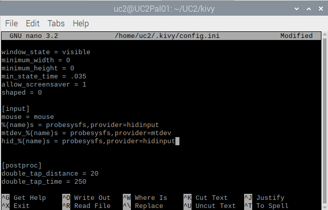

# Setting up NVIDIA JETSON
	
## OUTLINE
	* Install and prepare Jetson Jetpack
	* Install V4L2 drivers
	* Install Python3.7 + OpenCV 
	* Install Alvium Drivers
	* Installing Kivy 
	* Optional Steps from now
    * Acknowledgements

<p align="center">

</p> 


We are assuming, that you have successfully installed the ```openCV``` distro running on Python 3.7 and can run the Allied Vision CAmera from Python 3.7 inside Python.  

## Preparing your Jetson Nano

### Screen + Case 

We use the 7 inch HDMI screen for the Jetson nano. This case from [Thingiverse](https://www.thingiverse.com/thing:3530421) holds the screen quiet well. 

### Setting up I2C

Setting up in the Jetson Nano is straight forward. You can follow [this](https://www.jetsonhacks.com/2019/07/22/jetson-nano-using-i2c/) tutorial. Typing 

```
i2cdetect -y -r 1
```

will list your devices (i.e. motor). 

### Jetson Nano Preparation

1.) Prepare the SD card following this link: [https://developer.nvidia.com/embedded/learn/get-started-jetson-nano-devkit](https://developer.nvidia.com/embedded/learn/get-started-jetson-nano-devkit) (use Etcher and format the SD card before installing firmware!)

2.) Install all necessary packages + PYthon following this link [https://docs.nvidia.com/deeplearning/frameworks/install-tf-jetson-platform/index.html](https://docs.nvidia.com/deeplearning/frameworks/install-tf-jetson-platform/index.html)
(Tensorflow/Keras, etc. is not required yet)

3.) Install the Video4Linux2 (V4L2) support for python
[https://pypi.org/project/pyv4l2/](https://pypi.org/project/pyv4l2/)
```sudo apt-get install qv4l2```
```sudo apt-get install libv4l-dev```
and
```pip3 install pyv4l2```


4.) A package to detect the camera is this here:
```sudo apt-get install v4l-utils```
find the camera (```/dev/video0```) by typing:
```v4l2-ctl --list-devices​```

it may give you something like this:

```
vi-output, avt_csi2 6-003c (platform:54080000.vi:0):
        /dev/video0
```

5.) Install some further python packages:
[v4l2capture](https://pypi.org/project/v4l2capture/)
[pyv4l2](https://pypi.org/project/pyv4l2/)


### Use Alvium CSI CAmera

1.) Test Allied Vision Examples:

```
cd ~Downloads

git clone https://github.com/alliedvision/examples

cd GStreamer

sudo ./gstreamer_install.sh

./gstreamer_live.sh -b nvidia -d /dev/video0
```

you should now see a live-stream of the camera. Eventually reboot before this step.

### Use VIMBA Python with the USB version

The Allied vision cameras come as CSI and USB3 versions. The latter can work with the ```Vimba Python``` API as an installable package provided by Allied Vision on their [github page](https://github.com/alliedvision/VimbaPython).

We managed to get it run on the Nvidia Jetson. Though it's not straight forward, since Vimba requires Python 3.7 and OpenCV. Therefore we need to build it from source. Nevertheless, the effort is worth it!

### 1. Install Python 3.7
If you haven't already done so execute:

```
sudo apt install python3.7-dev
```
and make it the default python version on the Jetson:

```
update-alternatives  --install /usr/bin/python python /usr/bin/python3.7 1
```

### 2. Install Allied Vision SDK

Go to their website and download the SDK for ARM64 and follow the installation instructions
https://www.alliedvision.com/en/products/software.html#c6444

### 3. Install OpenCV on Python 3.7 (takes a while)

#### Swap-file

The build-process requires quiet some RAM, so we need to expand it by creating a swap file:

```
sudo dd if=/dev/zero of=/swapfile bs=1M count=4096

sudo chmod 600 /swapfile
sudo mkswap /swapfile
sudo swapon /swapfile
```


Also, to make the swapfile activated during reboot, edit ```/etc/fstab```:

```
sudo nano /etc/fstab
```

And add the following line:
```
/swapfile none swap 0 0
```


#### Install dependencies

Please see this [post](https://pythops.com/post/compile-deeplearning-libraries-for-jetson-nano)

```
sudo apt-get update
sudo apt-get upgrade
dependencies=(build-essential
              cmake
              pkg-config
              libavcodec-dev
              libavformat-dev
              libswscale-dev
              libv4l-dev
              libxvidcore-dev
              libavresample-dev
              python3-dev
              libtbb2
              libtbb-dev
              libtiff-dev
              libjpeg-dev
              libpng-dev
              libtiff-dev
              libdc1394-22-dev
              libgtk-3-dev
              libcanberra-gtk3-module
              libatlas-base-dev
              gfortran
              wget
              unzip)
sudo apt install -y ${dependencies[@]}
```

#### Download and build OpenCV from source
```
cd ~/Downloads
wget https://github.com/opencv/opencv/archive/4.2.0.zip -O opencv-4.2.0.zip
wget https://github.com/opencv/opencv_contrib/archive/4.2.0.zip -O opencv_contrib-4.2.0.zip
unzip opencv-4.2.0.zip
unzip opencv_contrib-4.2.0.zip
mkdir opencv-4.2.0/build
cd opencv-4.2.0/build
Configure the build
cmake -D CMAKE_BUILD_TYPE=RELEASE \
      -D WITH_CUDA=ON \
      -D CUDA_ARCH_PTX="" \
      -D CUDA_ARCH_BIN="5.3,6.2,7.2" \
      -D WITH_CUBLAS=ON \
      -D WITH_LIBV4L=ON \
      -D BUILD_opencv_python3=ON \
      -D BUILD_opencv_python2=OFF \
      -D BUILD_opencv_java=OFF \
      -D WITH_GSTREAMER=OFF \
      -D WITH_GTK=ON \
      -D BUILD_TESTS=OFF \
      -D BUILD_PERF_TESTS=OFF \
      -D BUILD_EXAMPLES=OFF \
      -D OPENCV_EXTRA_MODULES_PATH=../../opencv_contrib-4.2.0/modules \
      -D PYTHON3_LIBRARY=/usr/lib/aarch64-linux-gnu/libpython3.7m.so \
      -D PYTHON3_EXECUTABLE=/usr/bin/python3.7 \
      -D PYTHON3_INCLUDE_DIR=/usr/include/python3.7m \
      ..
```

The last part for Python3.7 support is important!

#### Build the package and install

```
make -j4
sudo make install
```

#### Verification

```python```

and enter

```import cv2```

#### Optional packages:

```
#reinstall numpy
pip install -I numpy
sudo python -m pip install matplotlib
sudo pip uninstall PIL -y
sudo pip uninstall Pillow -y
sudo pip install Pillow
```

## Install Vimba Python API

```
cd ~/Downloads
git clone https://github.com/alliedvision/VimbaPython
chmod 755 Install.sh
sudo ./Install.sh
# alternatively
# pip install ./ -e
-> Python 3.7
-> With numpy
-> With OpenCV

cd VimbaPython/examples
python asynchronous_grab_opencv.py
```


**Done!**


    

## Installing Kivy 
* **Install Kivy-dependencies** as described within 1. and 2. bullet-point of [official Kivy-homepage](https://kivy.org/doc/stable/installation/installation-linux-venvs.html#installation-in-venv) as preparation to use our GUI. 

### Install necessary system packages

We are *not* working with virtual environments - maybe that's the better way to go! 

```
sudo apt-get install -y \
    python-pip \
    build-essential \
    git \
    ffmpeg \
    libsdl2-dev \
    libsdl2-image-dev \
    libsdl2-mixer-dev \
    libsdl2-ttf-dev \
    libportmidi-dev \
    libswscale-dev \
    libavformat-dev \
    libavcodec-dev \
    zlib1g-dev \
    xclip \
    xsel
```

This makes sure, that the livestream window in the GUI is "always on top" (HACKY!)
```
sudo apt-get install wmctrl 
```


```
export USE_X11=1
```


### install the correct Cython version
```
pip install Cython==0.29.10
```

### install gstreamer

```
sudo apt-get install -y \
    libgstreamer1.0 \
    gstreamer1.0-plugins-base \
    gstreamer1.0-plugins-good
```
    
### Install stable version of Kivy

```
pip install --no-binary kivy
```

and check if it works by:
```
python
import kivy
```

should show somehting like

```
>>> import kivy
[INFO   ] [Logger      ] Record log in /home/bene/.kivy/logs/kivy_20-08-03_3.txt
[INFO   ] [Kivy        ] v2.0.0rc3, git-9ff5f12, 20200803
[INFO   ] [Kivy        ] Installed at "/home/bene/.local/lib/python3.7/site-packages/kivy/__init__.py"
[INFO   ] [Python      ] v3.7.5 (default, Nov  7 2019, 10:50:52) 
[GCC 8.3.0]
[INFO   ] [Python      ] Interpreter at "/usr/bin/python3.7"
```

#### Device permissions

When you app starts, Kivy uses Mtdev to scan for available multi-touch devices to use for input. Access to these devices is typically restricted to users or group with the appropriate permissions.
We need to add the user to the ‘input’ group. Type:

```
$ sudo adduser $USER input
```

Note that you need to log out then back in again for these permissions to be applied.


* **Setup the device** Once Kivy is finished, configure the touch-screen of RasPi (if installed) as valid input-method. Hence, in the terminal run


    ```
    $ nano ~/.kivy/config.ini
    ```
    
    and search (Ctrl+W) for `[input]` and add a line 
    
    ```
    $ mtdev_%(name)s = probesysfs,provider=mtdev
    $ hid_%(name)s = probesysfs,provider=hidinput

    ```
    
    <p align="center">
    
    </p> 
    Then (Ctrl+X) and save the changes.

* Hint: for any further issues configuring kivy with RasPi-screen, check [this description](https://github.com/mrichardson23/rpi-kivy-screen).

**Congratulations!** KIVY is now prepared to run properly on your device. 


### Additional packages
```
sudo apt-get install python3-scipy python3-matplotlib -y
pip install unipath ruamel.yaml pyyaml imageio safe-cast smbus paho.mqtt numpy matplotlib pyserial tifffile
```


### Install gstreamer for audio, video (optional)

**Congratulations!** KIVY is now prepared to run properly on your device. 

### Install the UC2 APP

open the bashrc and add:

```
nano ~/.bashrc
export DBUS_FATAL_WARNINGS=0
export KIVY_GL_BACKEND=gl
touch ~/.bashrc 

git clone https://github.com/bionanoimaging/UC2-Software-GIT/tree/master/GUI/RASPBERRY_PI
cd UC2-Software-GIT
python main.py
```


## Running the MQTT server

If you decided to use your system with the I2C-protocoll in a wired state, you can skip this part. If you decided to use the MQTT (WiFi-based) service to connect to your Micro-Controller (ESP32 -> for hardware like LED, motor etc) then you need to install the mosquitto server. For now, we will only setup a non-secured connection as we assume, that your WiFi is anyways local and non-public as well as uses WPA2. In a terminal, run: 
```
$   sudo apt-get install mosquitto mosquitto-clients
``` 
The service will automatically start and is running. Nice! 

## Preparing and running our GUI
* First, let's make sure that the RasPi cam is properly connected and available. In a terminal, run: 
    ```
    $ raspistill -k
    ```
    and close the camer-stream via Ctrl+C. If the camera is not starting or you encounter some errors, try to make it work before continuing the guide. 
* Now, let's prepare our UC2env by installing the necessary packages: 
    ```
    $ source activate UC2env
    $ conda install numpy matplotlib pyserial
    $ python -m pip install unipath ruamel.yaml pyyaml imageio safe-cast picamera smbus paho.mqtt 
    $ cd ~/UC2/
    $ git clone https://github.com/bionanoimaging/UC2-Software-GIT.git
    * mkdir UC2-GUI
    $ cp -r ./UC2-Software-GIT/GUI/RASPBERRY_PI/RASPIapp_py3/* ./UC2-GUI
    ```
    As you might have noted, with the last command you had to download way too many files. We are still searching for a good script to download only the necessary folders from our archive for particular tasks. Contact us, if you have any ideas. :)
* Now, we need to make sure which setup-ID is assigned with the Raspi. Therefor, in a terminal open: 
    ```
    $ cd UC2-GUI
    $ nano fluidiscopeGlobVar.py
    ```
    Search for the (Ctr+W) `setup_number` and change it to e.g. `001`.
    <p align="center">
    
    </p> 
* Run the GUI, by running: 
    ```
    $ python main.py
    ```
    It should start without any errors, but maybe it is overscaled on the first start. Just restart it and it should work. Press "CUS" on the left to get the LED-array-manipulation window and press "Start Preview" on the top to start your camera-stream. 
    <p align="center">
    
    </p>   

## Connecting the Microcontrollers
We reached the final preparation step. Depending on whether you chose to use ESP32 + MQTT or Arduino + I2C - connection your path from here on splits. 
* [The ESP32 + MQTT PATH](../../HARDWARE_CONTROL/ESP32/README.md)
* [The ARDUINO + I2C PATH](../../HARDWARE_CONTROL/ARDUINO/README.md)

Once the devices are setup and powered (running), restart your GUI on the RASPI. To control e.g. the LED-array, on the left click "CUS" and click on the different fields on the right, thereby (de-) activating the different LED elements. 

## How to work with the GUI
Will come soon. :)

## Viewing images or copying them from the device
Finally, you took some images and want to process them. You now have multiple options. You can:
* View them directly using the typical File-Browser installed on your RasPi 
* copy the files on a USB-drive
* access the Raspi using sFTP connection
* so many options more, but let's stick with the ones above :)
We will briefly describe how to access your device using the sFTP-interface. In our case, we suggest the free tool [FileZilla](https://filezilla-project.org/download.php). Download and install it onto your PC. 

...further explanation will come soon.


# Optional Steps from now
## Sharing the finished (prepared) Image
For sharing your prepared SDcard (e.g. to save a lot of time setting up more than 1 RasPi) Shrinking the size of the main partition (/dev/root) to make swapping between SDcards of different size (even if they are claiming to be 16GB the final size might differ by 1-500mb) or online easier is recommended. For our main-partition this cannot be done in-place (=while Raspbian is running), because the partition to be resized has to be unmounted. Hence, we suppose to using a boot media (e.g. USB-drive) with GPARTED on it. 
1. download [TUXBOOT](https://tuxboot.org/download/)
2. Create Bootable USB-drive by choosing GPARTED
3. Restart laptop, go to BIOS and boot from USB-drive
4. After LINUX came up: Mount SD-card and resize /dev/root partition to desired size (e.g. 6GB)
5. Test SD-card with RasPi


# Acknowledgements
Thanks go to:
* https://github.com/jjhelmus/berryconda for making Python 3.6 easily available for RaspberryPi. 
* X. Uwurukundu and N. Schramma for helping improve this guide. 
