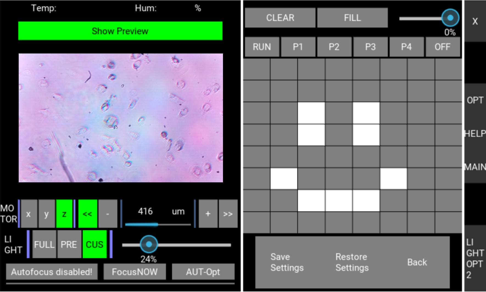
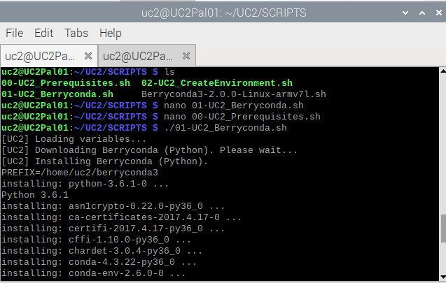
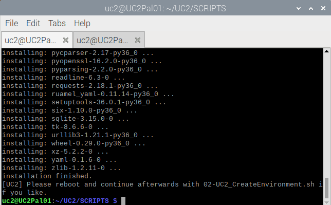
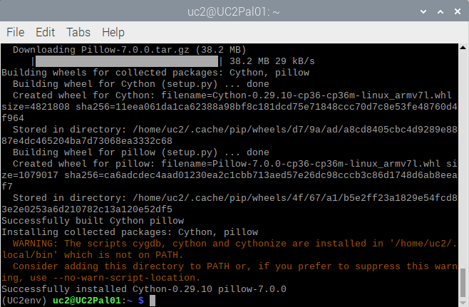
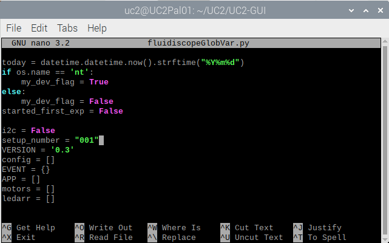
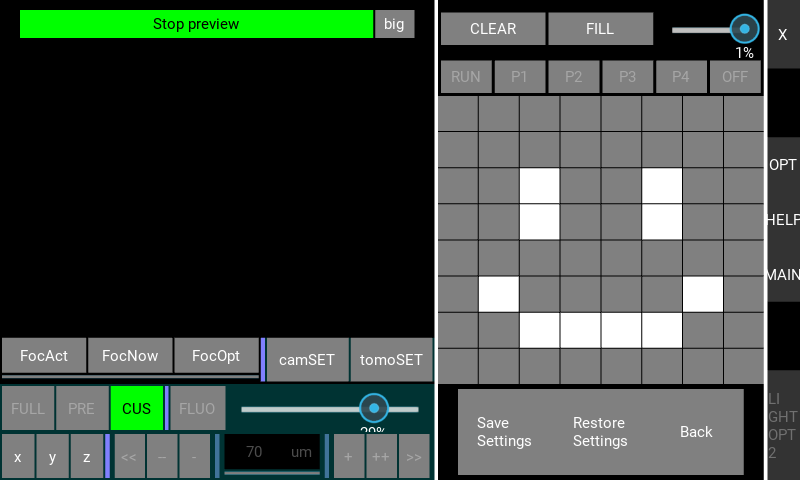

# Setting up Raspberry PI

## OUTLINE
	* Install and prepare RasPian
	* Setup UC2-env for our GUI
    * Installing Kivy 
    * Running the MQTT server
    * Preparing and running our GUI
	* Connecting the Microcontrollers
    * How to work with the GUI
    * Viewing images or copying them from the device
	* Optional Steps from now
    * Acknowledgements

<p align="center">

</p> 

## Preparing your Raspberry Pi (RasPi)
This guide for setting up our GUI will assume that you have the following prepared: 
*   You bought a Raspberry Pi (e.g. 4) **AND** an according display as well as a keyboard (ideally with an integrated mouse-pad) as input. 
*   You connected the hardware already (e.g. [like is explained here](https://www.instructables.com/id/Raspberry-Pi-Touchscreen-Setup/))

Setting up the RasPi can be done via SSH remotely as well, but finally our our camera-preview stream relies on a local DISPLAY and hence SSH is no longer an option - for now. ;)  

## Install and prepare RasPian 
1. **Download** ["Raspbian <NBR> with desktop"](https://downloads.raspberrypi.org/raspbian_latest), but without recommended software 
2. Flash raspian onto SD card by using e.g. [Win32DiskImager](http://sourceforge.net/projects/win32diskimager/files/latest/download) or [Etcher](https://www.balena.io/etcher/) (or follow [the official Raspian-guide](https://www.raspberrypi.org/documentation/installation/installing-images/README.md))
    <p align="center">
    
    </p> 
3. **Insert SD-card** into RasPi and start the device. Your display might be turned upside down. This will be handled soon. First:
    * Setup country info (e.g. Germany->German->Berlin->"Use English language"). Make sure, that your keyboard-input works as intended. Please find further information on how to setup RasPi on the [Official Homepage](https://www.raspberrypi.org/documentation/).
    * Changing the account password is optional, as we will anyways provide a routine for changing the username and password as well as locking the root-access below. 
    * Fix the Screen-scaling if necessary and connect to a local WiFi (which has internet-connection) and allow your RasPi to check for the newest updates. 
    * If updates are impossible due to: "Could not sync time - unable to check fo updates" error, you can fix date and time manually. You now have two options: You can either download our fix_date script from the [SCRIPTS section](./SCRIPTS/README.md) for ease of input (especially if you will have to fix the time more often...) and enter the date as suggested from commandline **OR** fix the entry directly by opening a terminal and enter your actual time like e.g.:
        ```
        $ sudo date -s "Mon Mar 16 18:00:00 CET 2020"
        ```
    changing the date. Now open a terminal and try to invoke the update manually by typing: 
         ```
        $ sudo apt-get update && sudo apt-get upgrade -y
        $ sudo reboot now
        ```   
    * (OPTIONAL) If e.g. 7" Touch-Screen is used: rotating the Screen might be necessary. In a Terminal enter (for 2x90° rotation)
        ```
        $ sudo sh -c "echo 'lcd_rotate=2' >> /boot/config.txt"
        $ sudo reboot now
        ```
        Note: This step could be done in advance on your PC/Laptop already. 
4. **Activate interfaces** and configure device. In a terminal enter:
    ```
    $ sudo raspi-config
    ```     
    go to *Interfacing Options* and enable:
    *   [Camera](https://www.raspberrypi.org/documentation/configuration/camera.md)
    *   [SSH](https://www.raspberrypi.org/documentation/remote-access/ssh/)
    *   (OPTIONAL) the [I2C](https://learn.adafruit.com/adafruits-raspberry-pi-lesson-4-gpio-setup/configuring-i2c)-interface. 
    
    Finish and reboot. 
5. **Change username and disable root.** First, give a password to the root-account. Open a terminal and type: 
    ```
    $ sudo passwd root
    ```
Enter a suitable password. Then, reboot into a shell so that no process of your right now active user **pi** is already running after boot. Hence open again the Raspi-Configuration interface (`sudo raspi-config`) and go to `boot options` -> `Desktop/CLI` (Raspi4) -> `Console` (without(!) Autologin) -> click on `Finish` and agree to reboot. Now: *login* as `root` and type: (**Note:** Replace "your-uc2name" together with the brackets to your favored username. )

    $ usermod -l <your-uc2name> pi
    $ usermod -m -d /home/<your-uc2name> <your-uc2name>
    $ passwd <your-uc2name>
    $ logout

Now: login as your new <your-uc2name>-User and, after connecting to internet (which should happen automatically), test:

    $ sudo apt-get update

if it works, lock the root-account for safety:

    $ sudo passwd -l root
    $ sudo apt-get upgrade
    $ sudo raspi-config

And (as before) go to the boot-options now enabling `Desktop Autologin` to boot into your new account directly. Now reboot. 


6. Change RasPi- and hostname:
    1. In `sudo nano /etc/hosts` change the last entry `127.0.0.1 raspberrypi` (or 127.0.1.1) to  e.g. `127.0.0.1 UC2Pal01` (or 127.0.1.1 UC2Pal01), if it is your first raspberry in your group of setups. Save and exit (via `Ctrl+X` -> `y` and then hit enter) . (Comment: do not change anything above the mentioned line!)
    2. Then `sudo nano /etc/hostname` and change the name to the same name as used above. Save, exit and reboot. 
    
## Setup UC2-env for our GUI

For easy Python-environment handling, install the [Berryconda](https://github.com/jjhelmus/berryconda) derivate of [Anaconda](https://www.anaconda.com/). We prepared some convenient-scripts that you can download from our [SCRIPTS-section](SCRIPTS/SETUP_UC2env) to install Berryconda, setup a UC2env for development and activate it as standard.

### Disclaimer
By using this install script you **agree** to the following [license agreement](https://github.com/jjhelmus/berryconda/blob/master/LICENSE.txt) available in the following [repository](https://github.com/jjhelmus/berryconda).


### Installing
* **Download all files** of the [SCRIPTS-section](SCRIPTS/SETUP_UC2env)
For downloading the files, first create two new directories:
    ```
    $ mkdir -p ~/UC2/SCRIPTS
    $ cd ~/UC2/SCRIPTS
    ```
    and then download the Script files there as follows:
    ```
    $ wget https://raw.githubusercontent.com/bionanoimaging/UC2-Software-GIT/master/GUI/RASPBERRY_PI/SCRIPTS/SETUP_UC2env/00-UC2_Prerequisites.sh
    $ wget https://raw.githubusercontent.com/bionanoimaging/UC2-Software-GIT/master/GUI/RASPBERRY_PI/SCRIPTS/SETUP_UC2env/01-UC2_Berryconda.sh
    $ wget https://raw.githubusercontent.com/bionanoimaging/UC2-Software-GIT/master/GUI/RASPBERRY_PI/SCRIPTS/SETUP_UC2env/02-UC2_CreateEnvironment.sh
    ```
* After downloading all 3 files, make the files runable via:
    ```
    $ chmod +x 00-UC2_Prerequisites.sh 01-UC2_Berryconda.sh 02-UC2_CreateEnvironment.sh

    ```
* **Run** 01-UC2_Berryconda.sh and after that 02-UC2_CreateEnvironment.sh by typing:
    ```
    $ ./01-UC2_Berryconda.sh
    $ ./02-UC2_CreateEnvironment.sh
    ```
    The first Command installs Berryconda
    <p align="center">
        
    </p>
    <p align="center">
        
    </p>    
    Reboot and run the second command which should give you: 
    <p align="center">
        
    </p>
    <p align="center">
        
    </p>     
* Check whether installation was successful via
    ```
    $ which conda 
    $ which python
    $ source activate UC2env
    $ which python
    $ python
    $ exit()
    ```
    which will should look something like this: 
    <p align="center">
    
    </p> 
    to make sure that the environment and proper python version (here: 3.6.1) is installed.
## Installing Kivy 
* **Activate** the conda *UC2env* environment 
    ```
    $ source activate UC2env
    ``` 
* **Install Kivy-dependencies** as described within 1. and 2. bullet-point of [official Kivy-homepage](https://kivy.org/doc/stable/installation/installation-rpi.html) as preparation to use our GUI. 
    ```
    sudo apt update
    sudo apt install libsdl2-dev libsdl2-image-dev libsdl2-mixer-dev libsdl2-ttf-dev \
    pkg-config libgl1-mesa-dev libgles2-mesa-dev \
    python-setuptools libgstreamer1.0-dev git-core \
    gstreamer1.0-plugins-{bad,base,good,ugly} \
    gstreamer1.0-{omx,alsa} python-dev libmtdev-dev \
    xclip xsel libjpeg-dev
    python -m pip install --upgrade pip setuptools
    python -m pip install --upgrade Cython==0.29.10 pillow   
    ```
     <p align="center">
    
    </p>    
    The Python-package Cython will be freshly compiled on your system and might need a while (~5min). If you have a Raspi3 (or older), make sure that you [enhance your RAM before](https://raspberrypi.stackexchange.com/questions/8308/how-to-install-latest-scipy-version-on-raspberry-pi) (the same is true for e.g. Numpy, Scipy etc on RasPi). 

* Note: If you get the warning: *The scripts cygdb, cython and cyhonie are installed in '/home/YOURUC2NAME/.local/bin' which is not on PATH*
    <p align="center">
    
    </p> 
    then try the following: 

    ```
    $ echo -e '#Adding Cython binary path to PATH' >> ~/.bashrc
    $ echo -e 'export PATH="/home/YOURUC2NAME/.local/bin:$PATH"' >> ~/.bashrc
    $ source ~/.bashrc
    $ source activate UC2env
    ```
* **Build Kivy** We suggest to build kivy on your system to get best performance with touch-screen and Window-provider even from within berryconda-environment. In the terminal, run: 
    ```
    $ cd ~/UC2
    $ git clone https://github.com/kivy/kivy
    $ cd kivy
    $ python -m pip install .
    ```
    The installation of kivy again will take a while (~15min, MEM<=500mb), so lean back and enjoy a coffee. 
* **Setup the device** Once Kivy is finished, configure the touch-screen of RasPi (if installed) as valid input-method. Hence, in the terminal run
    ```
    $ nano ~/.kivy/config.ini
    ```
    and search (Ctrl+W) for `[input]` and add a line 
    ```
    $ mtdev_%(name)s = probesysfs,provider=mtdev
    $ hid_%(name)s = probesysfs,provider=hidinput

    ```
    <p align="center">
    
    </p> 
    Then (Ctrl+X) and save the changes.

* Hint: for any further issues configuring kivy with RasPi-screen, check [this description](https://github.com/mrichardson23/rpi-kivy-screen).

**Congratulations!** KIVY is now prepared to run properly on your device. 

## Running the MQTT server
If you decided to use your system with the I2C-protocoll in a wired state, you can skip this part. If you decided to use the MQTT (WiFi-based) service to connect to your Micro-Controller (ESP32 -> for hardware like LED, motor etc) then you need to install the mosquitto server. For now, we will only setup a non-secured connection as we assume, that your WiFi is anyways local and non-public as well as uses WPA2. In a terminal, run: 
```
$   sudo apt-get install mosquitto mosquitto-clients
``` 
The service will automatically start and is running. Nice! 

## Preparing and running our GUI
* First, let's make sure that the RasPi cam is properly connected and available. In a terminal, run: 
    ```
    $ raspistill -k
    ```
    and close the camer-stream via Ctrl+C. If the camera is not starting or you encounter some errors, try to make it work before continuing the guide. 
* Now, let's prepare our UC2env by installing the necessary packages: 
    ```
    $ source activate UC2env
    $ conda install numpy matplotlib pyserial
    $ python -m pip install unipath ruamel.yaml pyyaml imageio safe-cast picamera smbus paho.mqtt 
    $ cd ~/UC2/
    $ git clone https://github.com/bionanoimaging/UC2-Software-GIT.git
    * mkdir UC2-GUI
    $ cp -r ./UC2-Software-GIT/GUI/RASPBERRY_PI/RASPIapp_py3/* ./UC2-GUI
    ```
    As you might have noted, with the last command you had to download way too many files. We are still searching for a good script to download only the necessary folders from our archive for particular tasks. Contact us, if you have any ideas. :)
* Now, we need to make sure which setup-ID is assigned with the Raspi. Therefor, in a terminal open: 
    ```
    $ cd UC2-GUI
    $ nano fluidiscopeGlobVar.py
    ```
    Search for the (Ctr+W) `setup_number` and change it to e.g. `001`.
    <p align="center">
    
    </p> 
* Run the GUI, by running: 
    ```
    $ python main.py
    ```
    It should start without any errors, but maybe it is overscaled on the first start. Just restart it and it should work. Press "CUS" on the left to get the LED-array-manipulation window and press "Start Preview" on the top to start your camera-stream. 
    <p align="center">
    
    </p>   

## Connecting the Microcontrollers
We reached the final preparation step. Depending on whether you chose to use ESP32 + MQTT or Arduino + I2C - connection your path from here on splits. 
* [The ESP32 + MQTT PATH](../../HARDWARE_CONTROL/ESP32/README.md)
* [The ARDUINO + I2C PATH](../../HARDWARE_CONTROL/ARDUINO/README.md)

Once the devices are setup and powered (running), restart your GUI on the RASPI. To control e.g. the LED-array, on the left click "CUS" and click on the different fields on the right, thereby (de-) activating the different LED elements. 

## How to work with the GUI
Will come soon. :)

## Viewing images or copying them from the device
Finally, you took some images and want to process them. You now have multiple options. You can:
* View them directly using the typical File-Browser installed on your RasPi 
* copy the files on a USB-drive
* access the Raspi using sFTP connection
* so many options more, but let's stick with the ones above :)
We will briefly describe how to access your device using the sFTP-interface. In our case, we suggest the free tool [FileZilla](https://filezilla-project.org/download.php). Download and install it onto your PC. 

...further explanation will come soon.


# Optional Steps from now
## Sharing the finished (prepared) Image
For sharing your prepared SDcard (e.g. to save a lot of time setting up more than 1 RasPi) Shrinking the size of the main partition (/dev/root) to make swapping between SDcards of different size (even if they are claiming to be 16GB the final size might differ by 1-500mb) or online easier is recommended. For our main-partition this cannot be done in-place (=while Raspbian is running), because the partition to be resized has to be unmounted. Hence, we suppose to using a boot media (e.g. USB-drive) with GPARTED on it. 
1. download [TUXBOOT](https://tuxboot.org/download/)
2. Create Bootable USB-drive by choosing GPARTED
3. Restart laptop, go to BIOS and boot from USB-drive
4. After LINUX came up: Mount SD-card and resize /dev/root partition to desired size (e.g. 6GB)
5. Test SD-card with RasPi


# Acknowledgements
Thanks go to:
* https://github.com/jjhelmus/berryconda for making Python 3.6 easily available for RaspberryPi. 
* X. Uwurukundu and N. Schramma for helping improve this guide. 
