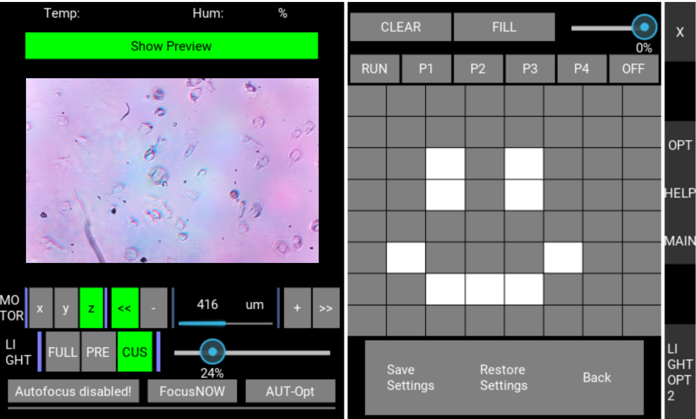
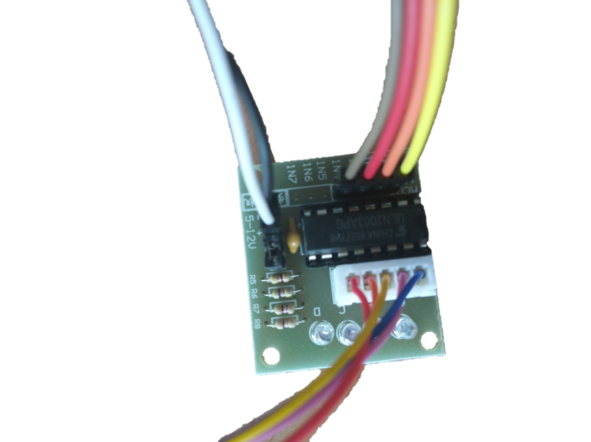

# **UC2 - Open and Modular Optical Toolbox**

---

      

Cite this repository: 

---

This is the online repository of the Software of the open-source hardware project ''UC2'' (You.See.Too.). For a general introduction on UC2 please check our [main repository](https://github.com/bionanoimaging/UC2-GIT).

## Click here if you're looking for
[RasPi GUI](./GUI/RASPBERRY_PI) | [Android App](./GUI/Android/UC2-TheBox)  | [Hardware Controlling](./HARDWARE_CONTROL)| [Something else](./SITEMAP.md)
:------:|:------:|:------:|:------:
|||

## [Get Involved! Contribute to the project!](CONTRIBUTING.md)

## ... or keep on reading to get started!

---

## Making **open-science** great again!
For a general introduction on UC2 please check our [main repository](https://github.com/bionanoimaging/UC2-GIT). Our basic belief centers around simple and clean modularity which - combined with creativity and curiosity - can lead to unbelievable achievements. Read more in the UC2 paper: [A versatile and customizable low-cost 3D-printed open standard for microscopic imaging](https://www.nature.com/articles/s41467-020-19447-9) .

# Getting Started
Like with our toolbox we tried to keep our interfaces modular as well. Therefore, hardware (like Motors, LED, ...) can be adressed using
*   Arduino (and alike) via I2C (Hardwired)
*   ESP32 (and alike) via MQTT (WiFI)

and could even be a mixture of both.Further, to control this components we provide two different graphical user interfaces (GUI):
*   Raspberry Pi (RasPi)
*   Android App

All useful links will be provided after the general shape of the repository is shortly displayed.

# Getting Started using the Raspberry Pi GUI

Find a detailed description [here](./GUI/RASPBERRY_PI)

# Getting Started using the Android APP

We have prepared a very basic control app for **TheBox** to have basic control over the hardware modules. The information can be found [here](./GUI/Android/UC2-TheBox).

 		

# Setting up the Micro-Controller
Depending on the micro-controller that will be connected the code that is needed for flashing can be found in different folders.
* [The ESP32 + MQTT PATH](./HARDWARE_CONTROL/ESP32)
* [The ARDUINO + I2C PATH](./HARDWARE_CONTROL/ARDUINO)

### Complete overview of setups, modules, parts to buy and parts to print
Find a complete shopping'n'printing list including estimated prices for all modules and setups and also the RasPi and Hardware controlling parts in this [BILL OF MATERIALS](https://docs.google.com/spreadsheets/d/1U1MndGKRCs0LKE5W8VGreCv9DJbQVQv7O6kgLlB6ZmE/edit?usp=sharing)!

# Get Involved
This project is open so that anyone can get involved. You don't even have to learn CAD designing or programming. Find ways you can contribute in  [CONTRIBUTING](CONTRIBUTING.md)

## Credits
R. Heintzmann, X. Uwurukundo, H. Wang, N. Schramma, E. Bingoel, B. Marsikova, B. Diederich, Lichtwerkstatt, IPHT Jena
